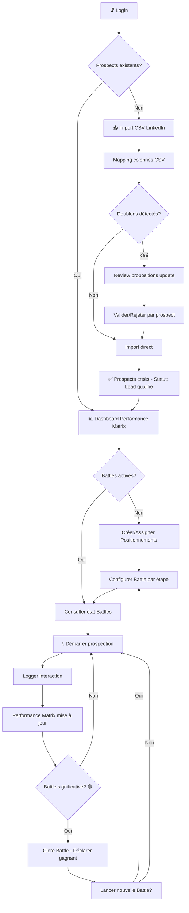
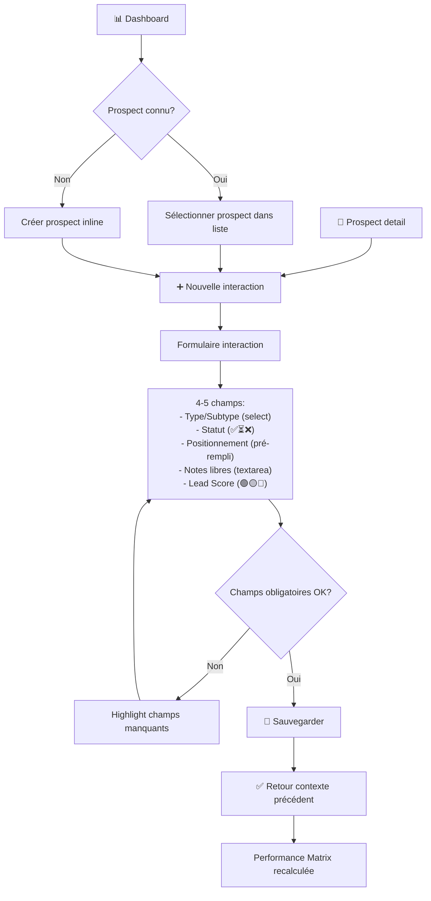
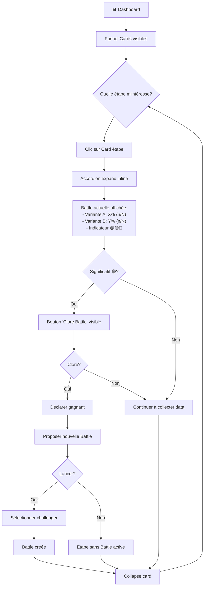
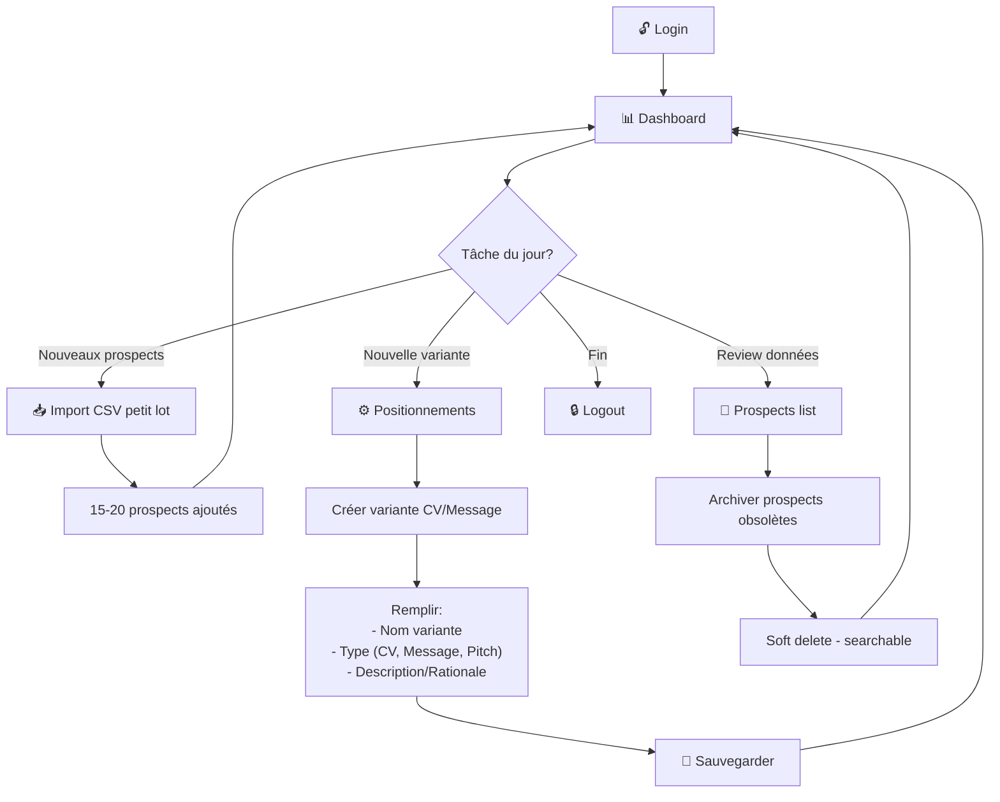

# UX Design Specification - tiny-crm

**Author:** Romain
**Date:** 2026-02-02

---

## Executive Summary

### Project Vision

tiny-crm est un CRM data-driven conçu spécifiquement pour les freelances consultants opérant en mode "machine de guerre en hibernation". L'application permet une optimisation continue de l'approche commerciale via A/B testing intuitif des variantes de positionnement (CV, pitchs, messages LinkedIn).

**Proposition de valeur unique :** Appliquer les principes du growth hacking à sa propre activité freelance - traiter chaque interaction comme une donnée exploitable pour l'amélioration continue.

**Scénario clé :** Mission se termine → Activation mode guerre en < 24h → Prospection intensive data-driven → Nouvelle mission signée en 30-45 jours.

**Philosophie UX :** "Quelques KPI très significatifs > 50 KPI mesurant tout". Simplicité scientifique, rigueur sans complexité.

### Target Users

**Utilisateur Principal : Romain**
- Développeur freelance prospectant auprès des ESN
- Alterne entre mode hibernation (préparation occasionnelle) et mode guerre (usage intensif quotidien)
- Tech-savvy, navigateurs modernes, desktop-first
- En mode guerre : 10-15 appels/jour, besoin de logging ultra-rapide

**Utilisateurs Secondaires : Amis Freelances**
- Accès contrôlé via variable d'environnement
- Isolation totale des données entre utilisateurs
- Même profil technique que l'utilisateur principal

**Contexte d'usage critique :** Chaque interaction de logging doit être plus rapide que "noter sur papier". Si l'app ralentit le workflow, abandon garanti.

### Key Design Challenges

1. **Contrainte Ergonomique Impitoyable**
   - Templates Notion CRM existent déjà comme alternative
   - Règle des 3 clics maximum non-négociable
   - Zéro popup sauf actions destructives

2. **Cold Start Critique**
   - Import CSV LinkedIn : 0 → 50 prospects en < 2 heures
   - Activation mode guerre complète en < 24h
   - Valeur visible dès 10 prospects (Performance Matrix fonctionnelle)

3. **Logging Minimal Friction**
   - Maximum 4-5 champs essentiels par interaction
   - Temps de logging < 1 minute
   - Pré-remplissage intelligent (dernier prospect, variante active)

4. **Complexité Analytique Accessible**
   - Performance Matrix lisible sans formation
   - Bayesian updating traduit en langage simple
   - Feu tricolore fiabilité comme seul indicateur statistique

5. **Équilibre Quantitatif/Qualitatif**
   - Cohabitation stats objectives et gut feeling
   - Lead Scoring simple (🟢🟡🔴) sans échelle complexe
   - Notes libres non-structurées pour capturer nuances

### Design Opportunities

1. **Performance Matrix Innovante**
   - Vue centrale unique absente des CRM classiques
   - Visualisation variante × étape funnel avec drill-down
   - Filtrage temporel par sprint pour suivi progression

2. **Sprints Itératifs Gamifiés**
   - Concept "runs" du gaming appliqué à la prospection
   - A vs B → Gagnant vs C → Apprentissage continu
   - Momentum et learning velocity vs paralysie analytique

3. **Drill-Down Contextuel Inline**
   - Informations liées visibles sans navigation
   - Parfait pour usage pendant appel téléphonique
   - Expansion/collapse fluide des détails

4. **Minimalisme Radical Comme Avantage**
   - Différenciation par la simplicité vs CRM surchargés
   - Chaque pixel justifié par un use case réel
   - Configuration isolée du workflow quotidien

## Core User Experience

### Defining Experience

**Action Centrale : Visualiser la Performance Matrix**

Le cœur de tiny-crm est la comparaison claire et sans erreur des positionnements (CV1 vs CV2 vs CV3...). Toutes les autres fonctionnalités (logging, import, navigation) existent pour alimenter et enrichir cette vue centrale.

**But Ultime : Auto-amélioration continue**

tiny-crm n'est pas un CRM de suivi classique - c'est un laboratoire d'optimisation personnelle. L'utilisateur doit pouvoir répondre à la question "Quel positionnement fonctionne le mieux ?" en un coup d'œil, à tout moment.

**Boucle d'Expérience Core :**
1. Préparer variantes de positionnement (CV, messages, pitchs)
2. Prospecter et logger les interactions
3. Visualiser la Performance Matrix
4. Identifier le gagnant
5. Itérer (gagnant vs nouvelle variante)

### Platform Strategy

**Type :** Single Page Application (SPA) Web

**Approche Device :**
- **Desktop-first** : Usage principal pendant sessions de prospection
- **Mobile-friendly** : Consultation rapide des stats, pas de saisie intensive
- **Pas d'app native** : Web responsive suffit pour les besoins

**Navigateurs :**
- Chrome et Firefox (2 dernières versions)
- Pas de support legacy (IE11, vieux Safari exclus)

**Offline :** Non requis - usage connecté assumé

**Input Principal :** Clavier + souris (pas d'optimisation touch prioritaire)

### Effortless Interactions

**Interactions Automatiques (Zero Effort) :**

| Interaction | Comportement Automatique |
|-------------|-------------------------|
| Sprint actuel | Détecté par date, pas de sélection manuelle |
| Doublons import | Détectés et signalés automatiquement |
| Dernier prospect | Pré-rempli dans formulaire interaction |
| Variante active | Pré-sélectionnée par défaut |
| Calculs Performance Matrix | Temps réel, pas de "refresh" |

**Drill-Down Contextuel (Effort Minimal) :**

Le drill-down inline est essentiel pour deux directions :
- **Prospect → Historique** : Voir toutes les interactions et positionnements utilisés pour un contact
- **Positionnement → Prospects** : Voir tous les prospects ayant reçu une variante spécifique

**Principe :** L'information contextuelle apparaît sur place, sans navigation ni perte de contexte.

### Critical Success Moments

**Moment 1 : Premier Import CSV Réussi**
- Quand : Cold Start, activation mode guerre
- Critère : 50 prospects importés en < 2h
- Échec si : Erreurs de mapping, doublons mal gérés, process trop long

**Moment 2 : Première Interaction Loggée Sans Friction**
- Quand : Après premier appel en mode guerre
- Critère : Logging complet en < 1 minute, 3 clics max
- Échec si : Trop de champs, validation bloquante, navigation confuse

**Moment 3 : Performance Matrix Lisible Immédiatement**
- Quand : Première consultation avec données réelles
- Critère : Comprendre "CV2 > CV1" en < 5 secondes
- Échec si : Trop de chiffres, pas de hiérarchie visuelle, confusion statistique

**Moment 4 : "Aha! J'ai trouvé le gagnant"**
- Quand : Fin du premier sprint avec assez de data
- Critère : Confiance dans la décision "CV2 est meilleur"
- Échec si : Doute sur la fiabilité, données contradictoires, pas de signal clair

### Experience Principles

**1. "Matrix First"**
La Performance Matrix est la vue maître. Tout le design doit faciliter sa lecture et son alimentation. Quand on hésite sur une décision UX, on se demande : "Est-ce que ça aide l'utilisateur à mieux comprendre la Matrix ?"

**2. "Context Without Navigation"**
Le drill-down inline remplace la navigation traditionnelle. L'utilisateur ne devrait jamais avoir besoin d'ouvrir un nouvel écran pour obtenir le contexte d'un élément. L'information vient à lui.

**3. "Capture Invisible"**
Le logging d'interactions doit être si fluide qu'il devient invisible. L'effort cognitif doit tendre vers zéro. Si l'utilisateur "sent" qu'il remplit un formulaire, c'est un échec.

**4. "Signal Over Noise"**
Chaque élément visuel doit amplifier le signal (quel positionnement gagne) et réduire le bruit (détails non-actionnables). Le feu tricolore fiabilité est l'exemple parfait : une information statistique complexe réduite à 🔴🟡🟢.

**5. "First Value Fast"**
L'utilisateur doit percevoir de la valeur dès 10 prospects dans le système. Pas besoin d'attendre 50+ data points. La Bayesian approach et les comparaisons relatives permettent des insights précoces.

## Desired Emotional Response

### Primary Emotional Goals

**Émotion Centrale : Protection Émotionnelle par la Data**

tiny-crm doit créer une distance psychologique saine entre l'utilisateur et les rejets. Les refus, ghosts, et échecs ne sont plus des coups à l'ego - ce sont des data points neutres qui alimentent l'optimisation.

**Reframing Psychologique Supporté :**
- ❌ "Je me fais ghoster → Je suis nul → Déprime"
- ✅ "Je me fais ghoster → Le CV n'est pas optimisé → J'itère"

**Émotions Cibles :**

| Émotion | Ce que l'utilisateur ressent |
|---------|------------------------------|
| **Résilience** | Les refus deviennent du carburant, pas des blessures |
| **Détachement sain** | "C'est le positionnement qui n'est pas optimal, pas moi" |
| **Contrôle** | "Je maîtrise ma prospection via l'analyse, pas via l'espoir" |
| **Progression** | "Chaque interaction me rapproche de la solution optimale" |
| **Clarté froide** | "Je sais exactement ce qui marche, sans émotions parasites" |

### Emotional Journey Mapping

**Phase 1 : Activation Mode Guerre (Potentiellement Stressant)**
- Contexte : Mission terminée, besoin de retrouver un contrat
- Émotion actuelle : Anxiété potentielle, pression
- Émotion cible : "J'ai un plan, j'ai mes outils, je contrôle la situation"
- Design implication : Cold Start rapide pour sentiment de contrôle immédiat

**Phase 2 : Prospection Active (Rejets Fréquents)**
- Contexte : Envoi de CV, messages, appels - beaucoup de non-réponses
- Émotion actuelle : Risque de découragement, prise personnelle
- Émotion cible : "Chaque refus est une donnée, pas un jugement sur moi"
- Design implication : Langage neutre, focus sur les taux pas sur les échecs

**Phase 3 : Consultation Performance Matrix (Moment de Vérité)**
- Contexte : Analyse des résultats après quelques semaines
- Émotion actuelle : Curiosité mêlée d'appréhension
- Émotion cible : "Je vois clairement ce qui marche, je peux agir"
- Design implication : Hiérarchie visuelle claire, signal > bruit

**Phase 4 : Identification du Gagnant (Moment "Aha!")**
- Contexte : CV2 performe mieux que CV1, c'est visible
- Émotion cible : "Mes données me donnent une réponse claire, je progresse"
- Design implication : Mise en évidence du gagnant, célébration subtile

**Phase 5 : Mission Signée (Victoire)**
- Contexte : Nouveau contrat obtenu
- Émotion cible : "Mon approche data-driven a payé, je recommencerai"
- Design implication : Possibilité de marquer le succès, boucler le cycle

### Micro-Emotions

**À Cultiver :**

| Micro-émotion | Contexte | Comment |
|---------------|----------|---------|
| **Confiance** | Lecture de la Matrix | Feu tricolore fiabilité, pas de chiffres ambigus |
| **Sérénité** | Face aux refus | Présentation neutre, pas de langage négatif |
| **Curiosité** | Exploration des données | Drill-down fluide, découverte sans effort |
| **Accomplissement** | Fin de sprint | Visualisation claire de la progression |
| **Autonomie** | Usage quotidien | Consultation à la demande, pas de notifications |

**À Éviter Absolument :**

| Micro-émotion | Déclencheur à éviter | Solution design |
|---------------|---------------------|-----------------|
| **Anxiété** | Alertes "performance en baisse" | Zéro notification push |
| **Honte** | Langage jugeant ("échecs", "ratés") | Vocabulaire neutre ("non-converti") |
| **Confusion** | Stats complexes, p-values | Feu tricolore uniquement |
| **Doute** | Données contradictoires | Signal clair, fiabilité visible |
| **Culpabilité** | "Tu n'as pas loggé depuis 3 jours" | Jamais de reproches |

### Design Implications

**Langage de l'Interface :**
- ✅ "12 prospects non-convertis" (neutre, factuel)
- ❌ "12 échecs" (jugeant)
- ✅ "CV v2 : 45% de conversion" (focus sur le positif)
- ❌ "CV v2 : 55% de rejet" (focus sur le négatif)

**Présentation des Données :**
- Les "refus" sont des data points, pas des échecs
- La Matrix montre des taux de CONVERSION (positif), pas des taux d'échec
- Pas de compteur de "jours sans activité" ou de "prospects perdus"

**Autonomie Totale :**
- L'utilisateur consulte quand IL veut
- Zéro notification, zéro alerte, zéro "tu devrais..."
- L'app est un outil passif, pas un coach intrusif

**Célébration Subtile :**
- Quand un gagnant émerge : indicateur visuel clair mais sobre
- Pas de fanfare, pas de gamification excessive
- La satisfaction vient de la clarté, pas du spectacle

### Emotional Design Principles

**1. "Data as Shield"**
L'app transforme les expériences émotionnellement difficiles (rejets) en données neutres. Le design doit toujours présenter l'information de manière factuelle et non-jugeante.

**2. "Never Blame, Always Inform"**
L'interface ne juge jamais l'utilisateur ni ses résultats. Elle informe. "CV v1 : 32% conversion" n'est ni bien ni mal - c'est une donnée pour décider.

**3. "User Initiates, App Responds"**
L'app ne prend jamais l'initiative de contacter ou alerter l'utilisateur. Elle attend d'être consultée. C'est l'utilisateur qui contrôle le moment de l'interaction.

**4. "Clarity Over Comfort"**
L'app ne cache pas les mauvais résultats pour "protéger" l'utilisateur. Elle les présente clairement mais de manière neutre. La vraie protection vient de la clarté, pas de l'ignorance.

**5. "Progress, Not Perfection"**
Le design met l'accent sur la progression (sprint après sprint) plutôt que sur des absolus. "CV v2 > CV v1" est plus important que "CV v2 = 45%".

## UX Pattern Analysis & Inspiration

### Inspiring Products Analysis

**Stratégie Design System : Bibliothèque de Composants**

Plutôt que de créer un design from scratch, tiny-crm s'appuiera sur une bibliothèque de composants moderne et éprouvée.

**Options considérées :**
- **shadcn/ui** (choix PRD) : Composants Radix UI + Tailwind, hautement customisables, accessibles
- **Mantine** : Bibliothèque complète React, 100+ composants, theming intégré
- **Autres** : Chakra UI, Ant Design, etc.

**Avantages de cette approche :**
- Design moderne et cohérent out-of-the-box
- Accessibilité intégrée (WCAG)
- Gain de temps massif sur le développement
- Patterns d'interaction éprouvés
- Maintenance simplifiée

**Inspirations Positives (Apps Préférées) :**

| App | Pourquoi ça marche |
|-----|-------------------|
| **ezBookkeeping** | Interface épurée, remplace Firefly 3 jugé trop fouilli |
| **CommaFeed** | Design moderne et clean, remplace FreshRSS jugé vieillot |

**Caractéristiques communes des apps préférées :**
- Hiérarchie visuelle claire
- Pas de surcharge d'éléments
- Design contemporain
- Focus sur l'essentiel

### Transferable UX Patterns

**Patterns à Adopter (depuis shadcn/ui et apps modernes) :**

| Pattern | Application dans tiny-crm |
|---------|--------------------------|
| **Cards épurées** | Affichage prospects/interactions dans listes |
| **Tables minimalistes** | Performance Matrix, listes avec tri/filtre |
| **Formulaires compacts** | Logging interactions, création prospects |
| **Accordions/Collapsibles** | Drill-down inline sans surcharger la vue |
| **Badges/Pills** | Statuts funnel, Lead Scoring (🟢🟡🔴) |
| **Popovers contextuels** | Infos supplémentaires sans navigation |
| **Command Palette** | (Future v2) Recherche globale CMD+K |

**Patterns de Navigation :**
- **Top navbar simple** : 3-4 items max (Prospects | Positionnements | Interactions | Settings)
- **Pas de sidebar** : Économie d'espace, focus sur le contenu
- **Breadcrumbs discrets** : Si drill-down profond, orientation sans encombrer

**Patterns de Data Visualization :**
- **Heatmap simple** : Performance Matrix avec couleurs pour conversion rates
- **Feu tricolore** : Indicateur de fiabilité statistique
- **Progress indicators** : Barre de progression funnel par prospect
- **Pas de graphiques complexes** : Pas de courbes, pas de camemberts - juste tableaux et heatmaps

### Anti-Patterns to Avoid

**Basé sur les apps abandonnées (Firefly 3, FreshRSS) :**

| Anti-Pattern | Pourquoi c'est problématique | Solution tiny-crm |
|--------------|-----------------------------|--------------------|
| **Interface "fouilli"** | Trop d'éléments, cognitive overload | Minimalisme agressif, chaque pixel justifié |
| **Design "vieillot"** | Apparence datée, manque de confiance | shadcn/ui moderne, Tailwind pour polish |
| **Sidebars surchargées** | Navigation complexe, perte de focus | Top navbar simple, 4 items max |
| **Widgets partout** | Distraction, bruit visuel | Uniquement Performance Matrix comme "dashboard" |
| **Formulaires interminables** | Friction, abandon | 4-5 champs max, tout optionnel sauf essentiel |
| **Popups à tout va** | Interruption du flow | Zero popup sauf actions destructives |
| **Dark mode forcé** | Préférence utilisateur ignorée | Light mode par défaut (dark si natif lib) |

**Anti-patterns CRM classiques à éviter :**
- Salesforce : Sur-fonctionnalité, complexité administrative
- HubSpot : Upsell constant, features cachées derrière paywall
- Notion templates CRM : Pas assez structuré pour analytics A/B

### Design Inspiration Strategy

**Ce qu'on ADOPTE directement :**

| Élément | Source | Rationale |
|---------|--------|-----------|
| Composants UI | shadcn/ui | Modern, accessible, Tailwind-native |
| Layout | Top navbar + content | Simple, focus sur données |
| Color scheme | Light mode | Préférence utilisateur explicite |
| Typography | Tailwind defaults | Clean, lisible, professionnel |
| Spacing | Tailwind spacing scale | Cohérent, aéré |

**Ce qu'on ADAPTE :**

| Élément | Adaptation |
|---------|------------|
| Tables shadcn | + heatmap coloring pour Performance Matrix |
| Cards shadcn | + expand/collapse pour drill-down inline |
| Forms shadcn | Simplifiés au maximum, pré-remplissage intelligent |
| Badges shadcn | Customisés pour Lead Scoring et statuts funnel |

**Ce qu'on ÉVITE :**

| Élément | Pourquoi |
|---------|----------|
| Dark mode custom | Effort inutile (light mode préféré, dark natif si dispo) |
| Graphiques complexes | Bruit visuel, pas de valeur ajoutée pour le use case |
| Animations fancy | Distraction, ralentissement perçu |
| Gradients/Shadows lourds | Effet "daté" potentiel |
| Icônes partout | Préférer texte clair quand possible |

**Principe Directeur :**
> "Si shadcn/ui le fait bien out-of-the-box, on l'utilise tel quel. On customise uniquement quand le use case l'exige (Performance Matrix, drill-down)."

## Design System Foundation

### Design System Choice

**Choix Principal : shadcn/ui + Tailwind CSS**

Stack UI retenue pour tiny-crm :
- **Tailwind CSS** : Utility-first CSS framework
- **shadcn/ui** : Collection de composants Radix UI pré-stylés avec Tailwind
- **Radix Primitives** : Fondation accessible sous-jacente

### Rationale for Selection

| Critère | Pourquoi shadcn/ui |
|---------|-------------------|
| **Ownership** | Code copié dans le projet, pas de dépendance runtime - contrôle total |
| **Tailwind-native** | Cohérent avec la stack technique du PRD |
| **Accessibilité** | Radix primitives WCAG-compliant out-of-the-box |
| **Customisation** | Modification directe des composants sans "ejection" |
| **Modernité** | Design contemporain aligné avec préférences (ezBookkeeping, CommaFeed) |
| **Expertise** | Utilisateur expert frontend - aucune friction d'adoption |

### Implementation Approach

**Stratégie d'intégration :**

1. **Installation sélective** : Ajouter uniquement les composants utilisés (pas de bundle inutile)
2. **Composants de base prévus** :
   - `Table` : Performance Matrix, listes prospects
   - `Card` : Affichage prospects, interactions
   - `Accordion/Collapsible` : Drill-down inline
   - `Form` / `Input` / `Select` : Logging interactions, création prospects
   - `Badge` : Lead Scoring (🟢🟡🔴), statuts funnel
   - `Button` : Actions principales
   - `Popover` : Infos contextuelles légères

3. **Pas de composants prévus** :
   - `Dialog/Modal` : Zéro popup (sauf confirmation destructive)
   - `Toast/Notification` : Pas d'alertes intrusives
   - `Tabs` : Navigation top navbar simple suffit

### Customization Strategy

**Personnalisations planifiées :**

| Composant | Customisation |
|-----------|---------------|
| `Table` | + Heatmap coloring pour taux de conversion dans Performance Matrix |
| `Card` | + Expand/collapse intégré pour drill-down inline |
| `Badge` | Variantes custom pour Lead Scoring et statuts funnel |
| `Form` | Pré-remplissage intelligent (dernier prospect, variante active) |

**Tokens de design :**
- Couleurs : Palette light mode, accents pour heatmap (vert→jaune→rouge)
- Typographie : Defaults Tailwind (clean, lisible)
- Spacing : Tailwind spacing scale standard
- Radius : Defaults shadcn (modern rounded corners)

**Principe directeur :**
> "Si shadcn/ui le fait bien out-of-the-box, on l'utilise tel quel. On customise uniquement quand le use case l'exige (Performance Matrix heatmap, drill-down inline)."

## Defining Core Experience

### The Defining Interaction

**"Voir d'un coup d'œil quel positionnement gagne à chaque étape du funnel"**

C'est l'interaction qui, si elle est parfaitement exécutée, fait le succès de tiny-crm. L'utilisateur doit pouvoir répondre instantanément à : "Pour l'étape X, quelle variante performe le mieux, et puis-je faire confiance à ce chiffre ?"

**Comment l'utilisateur décrirait tiny-crm à un ami :**
> "C'est un outil qui me dit quel CV marche le mieux, avec des vrais chiffres, pas du feeling."

### User Mental Model

**Situation actuelle :**
- Aucune structure pour l'A/B testing des positionnements
- Décisions basées sur le "feeling" uniquement
- Frustration : impossible de savoir objectivement ce qui fonctionne

**Modèle mental naturel :**
- Penser par **étape de funnel** (envoi CV, relance, entretien...)
- Pour chaque étape : "Quelle variante gagne ?"
- Besoin de **confiance** dans le chiffre (significativité statistique)

**Attentes utilisateur :**
- Réponse immédiate sans calcul mental
- Contexte de la Battle actuelle toujours visible par étape
- Drill-down sans perdre le fil

### Critical Insight: Battles Indépendantes (pas de Sprints Globaux)

**⚠️ ÉVOLUTION MAJEURE PAR RAPPORT AU PRD**

**Problème identifié avec le concept de "Sprint Global" :**

Le volume de données est asymétrique selon les étapes du funnel :
- Étapes early (envoi CV) : volume élevé → significativité rapide
- Étapes late (entretien, closing) : volume faible → significativité lente

Un "sprint global" qui reset tous les tests en même temps est inadapté car :
- L'étape CV aurait 3x trop de données pendant que l'étape Entretien n'a rien appris
- On perdrait l'apprentissage accumulé sur les étapes à faible volume

**Solution : Battles indépendantes par étape de funnel**

Chaque étape de funnel a sa propre "Battle" (A vs B) qui :
- Progresse à son propre rythme selon son volume
- Se clôture quand la significativité est atteinte
- Ne reset PAS les autres étapes quand elle se termine
- Permet de lancer la Battle suivante (Gagnant vs Challenger C)

**Exemple concret :**
```
Envoi CV:    Battle #4 (CV v3 vs v4)     ← Déjà 3 itérations !
Relance:     Battle #2 (Msg v1 vs v2)    ← Avance à son rythme
Entretien:   Battle #1 (Pitch v1 vs v2)  ← Toujours la première
Closing:     Pas de battle active        ← Volume insuffisant
```

**⚠️ ACTION REQUISE : Le PRD doit être mis à jour pour remplacer le concept de "Sprints Globaux" par "Battles Indépendantes par étape de funnel".**

### Success Criteria

| Critère | Mesure de succès |
|---------|------------------|
| **Clarté immédiate** | Identifier le gagnant par étape en < 3 secondes |
| **Confiance visible** | Feu tricolore (🟢🟡🔴) compris sans explication |
| **Contexte préservé** | Battle actuelle par étape toujours visible |
| **Drill-down fluide** | Détails accessibles sans navigation ni perte de contexte |
| **Scalabilité** | Fonctionne avec 3 ou 7 étapes de funnel |
| **Indépendance** | Chaque étape progresse à son rythme |

### Novel UX Patterns

**Pattern principal : Dashboard Funnel Cards + Accordion Expand**

Ce pattern est une **combinaison de patterns établis** adaptée au use case unique :

| Pattern utilisé | Source | Adaptation tiny-crm |
|-----------------|--------|---------------------|
| Dashboard cards | Analytics tools | Une card par étape funnel |
| Accordion expand | Standard UI | Drill-down inline sans navigation |
| Traffic light indicator | Form validation | Significativité statistique simplifiée |
| Per-card context | Novel | Battle actuelle affichée par card (pas globalement) |

**Pourquoi ce n'est pas un simple tableau :**
- Un tableau (rows=variantes, cols=étapes) force à scanner horizontalement
- Les cards permettent de voir "le gagnant" par étape instantanément
- L'accordéon garde le contexte tout en révélant les détails
- Chaque card est autonome avec sa propre Battle

### Experience Mechanics

**1. Initiation - Arriver sur le Dashboard**

- Landing page = Dashboard avec Performance Matrix
- Cards funnel affichées avec Battle actuelle de chaque étape
- Pas de header "sprint global" - chaque card porte son contexte

**2. Interaction - Scanner les résultats**

- Lecture verticale naturelle : card par card
- Chaque card répond à UNE question : "Qui gagne à cette étape ?"
- Feu tricolore attire l'œil sur la fiabilité
- Battle # visible pour savoir où on en est dans les itérations

**3. Drill-down - Explorer les détails**

- Clic sur card → expand inline (accordéon)
- Détails visibles : comparaison Battle actuelle + historique des Battles précédentes
- Barres de progression visuelles pour les taux
- Pas de navigation, pas de perte de contexte

**4. Action - Clore une Battle**

- Quand 🟢 significatif : bouton "Clore la Battle" apparaît
- Déclarer le gagnant → Champion de l'étape
- Lancer nouvelle Battle : Champion vs nouveau Challenger
- Les autres étapes continuent leur Battle en cours

**5. Completion - Décision prise**

- L'utilisateur sait quelle variante gagne par étape
- Il sait s'il peut faire confiance au résultat (🟢🟡🔴)
- Il peut agir : continuer le test, clore la Battle, itérer

### Dashboard Layout Specification

```
┌─────────────────┐  ┌─────────────────┐  ┌─────────────────┐
│ 📄 ENVOI CV     │  │ 📞 RELANCE      │  │ 🤝 ENTRETIEN    │
│                 │  │                 │  │                 │
│ Battle #4       │  │ Battle #2       │  │ Battle #1       │
│ CV v3 vs v4     │  │ Msg v1 vs v2    │  │ Pitch v1 vs v2  │
│                 │  │                 │  │                 │
│ Winner: CV v4   │  │ Winner: Msg v1  │  │ Pas assez data  │
│ 47% vs 32%      │  │ 62% vs 54%      │  │ 🔴              │
│ 🟢 Significatif │  │ 🟡 Tendance     │  │                 │
│                 │  │                 │  │                 │
│ [Clore Battle]  │  │                 │  │                 │
└─────────────────┘  └─────────────────┘  └─────────────────┘

▼ EXPANDED CARD (on click)
┌─────────────────────────────────────────────────────────────┐
│ Battle #4 actuelle:                                         │
│   CV v4: 47% (22/47)  █████████░  🟢                       │
│   CV v3: 32% (15/47)  ██████░░░░                           │
│                                                             │
│ Battles précédentes:                                        │
│   #3: CV v3 bat CV v2 (41% vs 33%)                         │
│   #2: CV v2 bat CV v1 (38% vs 28%)                         │
│   #1: CV v1 vs CV v0 (baseline)                            │
│                                                             │
│ Champion actuel: CV v4 (47%)                               │
└─────────────────────────────────────────────────────────────┘
```

**Notes d'implémentation :**
- Nombre de cards = nombre d'étapes funnel (configurable dans Settings)
- Chaque card est autonome avec sa propre Battle
- Cards responsive : grille adaptative selon largeur écran
- Une seule card expanded à la fois (ou plusieurs ? à tester)
- Action "Clore Battle" visible uniquement quand 🟢

## Visual Design Foundation

### Color System

**Approach: Tailwind/shadcn Defaults + Semantic Customization**

tiny-crm adopte les couleurs par défaut de Tailwind CSS et shadcn/ui, avec des personnalisations minimales pour les besoins spécifiques.

**Base Colors (shadcn defaults):**
- **Background:** `background` / `card` (light grays, whites)
- **Foreground:** `foreground` / `muted-foreground` (dark grays for text)
- **Primary:** `primary` (actions principales, boutons)
- **Secondary:** `secondary` (actions secondaires)
- **Accent:** `accent` (hover states, highlights)
- **Border:** `border` (séparateurs, contours)

**Semantic Colors (custom pour tiny-crm):**

| Usage | Color | Application |
|-------|-------|-------------|
| **Success / Hot Lead** | `green-500` / `green-600` | 🟢 Significatif, Lead chaud, conversion élevée |
| **Warning / Neutral** | `yellow-500` / `amber-500` | 🟡 Tendance, Lead neutre, données insuffisantes |
| **Error / Cold Lead** | `red-500` / `red-600` | 🔴 Insuffisant, Lead froid, conversion basse |
| **Heatmap High** | `green-100` → `green-500` | Cellules Performance Matrix (taux élevé) |
| **Heatmap Low** | `red-100` → `red-500` | Cellules Performance Matrix (taux bas) |
| **Heatmap Mid** | `yellow-100` → `yellow-400` | Cellules Performance Matrix (taux moyen) |

**Mode:** Light mode uniquement (préférence utilisateur explicite). Dark mode natif shadcn disponible si besoin futur.

**Accessibility:** Contraste WCAG AA garanti par les defaults Tailwind/shadcn.

### Typography System

**Approach: System Fonts via shadcn/Inter**

**Font Stack:**
- **Primary:** Inter (via shadcn) ou system-ui fallback
- **Monospace:** Pour code snippets si nécessaire (font-mono Tailwind)

**Type Scale (Tailwind defaults):**

| Element | Size | Weight | Usage |
|---------|------|--------|-------|
| **h1** | `text-3xl` (30px) | `font-bold` | Titres de page (Performance Matrix, Prospects) |
| **h2** | `text-2xl` (24px) | `font-semibold` | Sections principales |
| **h3** | `text-xl` (20px) | `font-semibold` | Sous-sections, card headers |
| **Body** | `text-base` (16px) | `font-normal` | Texte courant, labels |
| **Small** | `text-sm` (14px) | `font-normal` | Texte secondaire, metadata |
| **Caption** | `text-xs` (12px) | `font-medium` | Badges, indicateurs |

**Tone:** "Outil efficace de dev" - professionnel mais friendly, pas corporate. Clean et lisible.

**Text Areas (Usage spécifique):**
- **Interactions:** Textarea pour résumé d'échange (objectif + subjectif)
- **Prospects:** Textarea pour notes/commentaires spécifiques au contact
- **Positionnements:** Textarea potentiellement long (nom fichier CV ou texte complet de pitch)

### Spacing & Layout Foundation

**Approach: Hybrid Density**

| Context | Density | Rationale |
|---------|---------|-----------|
| **Performance Matrix** | Dense | Maximiser données visibles, scanner rapidement |
| **Listes (Prospects, Interactions)** | Dense | Efficacité en mode guerre, moins de scroll |
| **Formulaires (Logging, Création)** | Aéré | Réduire erreurs de saisie, clarté des champs |
| **Cards expandées (Drill-down)** | Modéré | Balance entre info et lisibilité |

**Spacing Scale (Tailwind):**
- **Base unit:** 4px (`space-1`)
- **Common spacings:** `space-2` (8px), `space-4` (16px), `space-6` (24px), `space-8` (32px)
- **Component gaps:** `gap-2` à `gap-4` selon densité
- **Section margins:** `my-6` à `my-8`

**Layout Grid:**
- **Responsive:** Tailwind breakpoints (sm, md, lg, xl)
- **Cards grid:** `grid-cols-1 md:grid-cols-2 lg:grid-cols-3` pour Funnel Cards
- **Max width:** `max-w-7xl` pour conteneur principal (éviter lignes trop longues)

**Principe directeur:**
> "Dense pour scanner, aéré pour saisir. L'efficacité prime sur l'esthétique décorative."

### Accessibility Considerations

**WCAG 2.1 Level A (avec éléments AA):**

| Requirement | Implementation |
|-------------|----------------|
| **Contraste texte** | Tailwind defaults (4.5:1 minimum) |
| **Contraste couleurs sémantiques** | Vert/Jaune/Rouge sur fond clair = OK |
| **Focus visible** | shadcn focus rings par défaut |
| **Taille minimum** | 16px body text, 44px touch targets |
| **Pas de color-only info** | Feu tricolore = emoji + couleur (🟢🟡🔴) |

**Heatmap Accessibility:**
- Couleurs + valeurs numériques affichées (pas color-only)
- Contraste suffisant entre niveaux de heatmap

**Keyboard Navigation:**
- Tab order logique (shadcn built-in)
- Accordions/Collapsibles accessibles au clavier

## Design Direction Decision

### Design Directions Explored

**Approche pragmatique :** shadcn/ui + Tailwind CSS, Dashboard avec Funnel Cards + Accordion Expand, "Outil efficace de dev" tone, Hybrid density.

Pas de mockups HTML générés - utilisateur expert frontend, pas besoin de validation visuelle préliminaire.

### Chosen Direction

**Direction : "Efficient Dev Tool"**

| Aspect | Décision |
|--------|----------|
| **Base visuelle** | shadcn/ui defaults |
| **Layout** | Top navbar + Dashboard central avec Funnel Cards |
| **Interaction** | Accordion inline pour drill-down, zéro popup |
| **Couleurs** | Tailwind defaults + sémantique (🟢🟡🔴) |
| **Densité** | Dense pour listes/matrix, aéré pour formulaires |
| **Mode** | Light mode uniquement |

### Design Rationale

1. **Cohérence avec philosophie produit** - Minimalisme agressif aligné avec "chaque pixel doit mériter sa place"
2. **Alignement avec contraintes utilisateur** - Expert frontend, mode guerre demande efficacité maximale
3. **Réduction des risques** - Composants shadcn testés et accessibles out-of-the-box
4. **Pragmatisme** - Pas de temps perdu sur des décisions design sans impact réel

### Implementation Approach

**Composants shadcn à utiliser :**
- `Card` - Funnel cards dashboard, prospect cards
- `Table` - Listes prospects/interactions, Performance Matrix
- `Accordion` - Drill-down inline, expandable sections
- `Form` / `Input` / `Textarea` - Logging interactions, création prospects
- `Badge` - Statuts funnel, Lead Scoring (🟢🟡🔴), significativité Battle
- `Button` - Actions primaires/secondaires
- `Dialog` - UNIQUEMENT pour confirmations destructives

**Customisations prévues :**
- Heatmap coloring sur Table pour Performance Matrix (taux conversion → couleur)
- Expand/collapse sur Cards pour drill-down inline
- Badge variants custom pour Lead Scoring et statuts Battle

## User Journey Flows

### Journey Flow 1: Réveil Machine de Guerre (Cold Start → Active Prospecting)

**Contexte:** Mission terminée, activation mode guerre en < 24h

**Flow Entry:** Login après période d'hibernation



**Points de friction éliminés:**
- Import CSV en 3 étapes max (upload → mapping → validation doublons)
- Pré-remplissage intelligent (dernier prospect, variante active)
- Dashboard comme landing page (pas de navigation pour voir l'essentiel)

### Journey Flow 2: Logging Interaction (Micro-Journey)

**Contexte:** En plein appel ou juste après, besoin de logger rapidement

**Flow Entry:** Depuis Dashboard ou depuis Prospect detail



**Règle des 3 clics respectée:**
1. Clic sur prospect (si pas déjà sélectionné)
2. Clic "Nouvelle interaction"
3. Clic "Sauvegarder" (après remplissage)

### Journey Flow 3: Consultation Performance Matrix

**Contexte:** Savoir quel positionnement gagne par étape

**Flow Entry:** Dashboard (landing page)



**Pattern clé:** Tout dans le Dashboard, zéro navigation vers autre page.

### Journey Flow 4: Hibernation Productive (Maintenance Mensuelle)

**Contexte:** Premier dimanche du mois, 2h de maintenance

**Flow Entry:** Login détendu



**Pattern clé:** Pas de pression, pas d'urgence. Préparation progressive.

### Journey Patterns

**Navigation Patterns:**

| Pattern | Usage | Implementation |
|---------|-------|----------------|
| **Dashboard as Home** | Landing page = Performance Matrix | Top navbar avec Dashboard toujours accessible |
| **Inline Drill-down** | Détails sans navigation | Accordion expand sur Cards et Tables |
| **Contextual Actions** | Actions liées à l'élément courant | Boutons dans Cards/Rows, pas dans toolbar globale |

**Decision Patterns:**

| Pattern | Usage | Implementation |
|---------|-------|----------------|
| **Traffic Light** | Significativité statistique | 🟢🟡🔴 avec texte hover si besoin |
| **Champion vs Challenger** | Battle A/B | Labels clairs, pas de jargon statistique |
| **Soft Confirm** | Actions non-destructives | Exécution directe, undo si erreur |
| **Hard Confirm** | Actions destructives | Dialog modal de confirmation |

**Feedback Patterns:**

| Pattern | Usage | Implementation |
|---------|-------|----------------|
| **Instant Update** | Après action CRUD | Mise à jour UI immédiate, pas de refresh |
| **Progress Implicit** | Pas de spinners intrusifs | Skeleton loaders discrets si besoin |
| **Error Inline** | Validation formulaire | Messages sous champs, pas d'alert popup |

### Flow Optimization Principles

1. **Entry Points Multiples, Destination Unique**
   - Plusieurs chemins pour logger une interaction (Dashboard, Prospect detail, raccourci)
   - Tous mènent au même formulaire minimal

2. **Progressive Disclosure**
   - Dashboard montre l'essentiel (winner + confiance)
   - Expand révèle les détails (comparaison, historique)
   - Settings isolés du workflow quotidien

3. **Fail Fast, Recover Easy**
   - Validation inline pendant la saisie
   - Undo disponible pour actions réversibles
   - Soft delete pour récupération données

4. **Zero Dead Ends**
   - Toujours une action suivante claire
   - Retour au Dashboard depuis partout
   - Breadcrumbs si drill-down profond

## Component Strategy

### Design System Components (shadcn/ui)

**Utilisés tels quels :**

| Component | Usage tiny-crm |
|-----------|---------------|
| `Button` | Actions primaires/secondaires partout |
| `Input` / `Textarea` | Formulaires (prospect, interaction, positioning) |
| `Select` | Type interaction, étape funnel, positionnement |
| `Dialog` | Confirmation actions destructives uniquement |
| `Tooltip` | Aide contextuelle légère |
| `Popover` | Détails supplémentaires sans navigation |

**Utilisés avec customisation légère :**

| Component | Customisation |
|-----------|--------------|
| `Card` | Expand/collapse, header avec Battle status |
| `Table` | Heatmap coloring, row click handlers |
| `Badge` | Variants sémantiques (Hot/Neutral/Cold, Significatif/Tendance/Insuffisant) |
| `Accordion` | Nested dans Cards pour drill-down |

### Custom Components

#### FunnelCard

**Purpose:** Afficher l'état d'une Battle A/B pour une étape de funnel

**Anatomy:**
```
┌─────────────────────────────┐
│ [Icon] ÉTAPE FUNNEL         │ ← Header (clickable pour expand)
│ Battle #N                   │
│ [Variante A] vs [Variante B]│
├─────────────────────────────┤
│ Winner: [Variante]          │ ← Summary (collapsed)
│ X% vs Y%    [🟢]            │
│ [Clore Battle]              │ ← Action (si significatif)
└─────────────────────────────┘

▼ Expanded:
┌─────────────────────────────┐
│ Battle actuelle:            │
│   A: X% (n/N) ████████░░    │ ← Progress bars
│   B: Y% (n/N) ██████░░░░    │
│                             │
│ Historique Battles:         │
│   #2: A > B (45% vs 38%)    │ ← Past battles
│   #1: B > C (42% vs 31%)    │
└─────────────────────────────┘
```

**States:** Default, Hover, Expanded, No Active Battle, Significant (🟢 action visible)

**Accessibility:** `aria-expanded`, keyboard expand/collapse, focus management

#### HeatmapCell

**Purpose:** Cellule Table avec coloration dynamique selon taux de conversion

**Anatomy:**
```
┌─────────┐
│  47%    │ ← Value
│  (22/47)│ ← Sample (n/N)
└─────────┘
   ↑
Background color: green-100→green-500 selon valeur
```

**States:** Low (red), Medium (yellow), High (green), No Data (gray)

**Variants:** Compact (% only), Full (% + sample)

**Accessibility:** `aria-label` avec valeur complète, couleur + texte (pas color-only)

#### TrafficLight

**Purpose:** Indicateur visuel de significativité statistique

**Anatomy:** `[🟢] Significatif` ou `[🟡] Tendance` ou `[🔴] Insuffisant`

**States:**
- 🟢 Green: Significativité statistique atteinte (>95% confiance)
- 🟡 Yellow: Tendance visible mais pas encore significatif (70-95%)
- 🔴 Red: Données insuffisantes (<70% ou n<10)

**Accessibility:** Emoji + text label, jamais color-only

#### LeadScoreBadge

**Purpose:** Indicateur qualitatif du prospect (gut feeling)

**Variants:**
- `hot`: 🟢 "Hot" - Prospect très intéressé
- `neutral`: 🟡 "Neutre" - Statut par défaut
- `cold`: 🔴 "Cold" - Ghost, pas intéressé, à éviter

**Interaction:** Click pour cycler entre états

#### CSVImportWizard

**Purpose:** Guider l'import CSV LinkedIn en 3 étapes

**Flow:** `Step 1: Upload → Step 2: Mapping → Step 3: Validation`

**States:** Upload, Mapping, Validating, Complete, Error

### Component Implementation Strategy

**Principe:** Composition over creation

1. **Étendre shadcn, pas remplacer** - FunnelCard = Card + Accordion + Badge composés
2. **Tokens cohérents** - Utiliser les CSS variables shadcn pour couleurs, spacing
3. **Accessibility first** - ARIA attributes, keyboard nav, focus management inclus dès le design

**Structure des composants custom :**
```
src/components/
├── ui/                    # shadcn components (copiés)
├── custom/
│   ├── FunnelCard.tsx
│   ├── HeatmapCell.tsx
│   ├── TrafficLight.tsx
│   ├── LeadScoreBadge.tsx
│   └── CSVImportWizard/
│       ├── index.tsx
│       ├── UploadStep.tsx
│       ├── MappingStep.tsx
│       └── ValidationStep.tsx
```

### Implementation Roadmap

**Phase 1 - MVP Core (Semaines 1-2):**
- FunnelCard (Dashboard central)
- HeatmapCell (Performance Matrix)
- TrafficLight (Significativité)

**Phase 2 - MVP Complete (Semaines 3-4):**
- LeadScoreBadge (Prospects list)
- CSVImportWizard (Import LinkedIn)

**Phase 3 - Polish (Post-MVP):**
- Animations expand/collapse
- Skeleton loaders
- Keyboard shortcuts

## UX Consistency Patterns

### Button Hierarchy

**Primary Actions:**

| Context | Action | Style |
|---------|--------|-------|
| Form submission | "Sauvegarder", "Créer" | `Button variant="default"` (solid) |
| Critical action | "Clore Battle", "Importer" | `Button variant="default"` |
| Destructive | "Supprimer", "Archiver" | `Button variant="destructive"` (rouge) |

**Secondary Actions:**

| Context | Action | Style |
|---------|--------|-------|
| Cancel/Back | "Annuler", "Retour" | `Button variant="outline"` |
| Optional | "Ajouter note", "Voir détails" | `Button variant="ghost"` |

**Placement Rules:**
- Primary à droite, Secondary à gauche
- Actions destructives toujours avec Dialog de confirmation
- Un seul Primary par contexte visible

### Feedback Patterns

**Success Feedback:**
- Toast bottom-right, auto-dismiss 3s
- Ex: "✅ Interaction enregistrée"
- Pas de modal pour succès
- Retour automatique au contexte précédent

**Error Feedback:**
- Inline sous le champ concerné
- Ex: "❌ Ce prospect existe déjà"
- Jamais de popup/alert pour erreurs de validation
- Highlight rouge sur champ en erreur
- Message explicite (pas de codes erreur)

**Warning Feedback:**
- Dialog modal si action conséquente
- Ex: "⚠️ Clore cette Battle déclarera CV v2 gagnant"
- Uniquement pour actions avec conséquences importantes

**Loading States:**
- Skeleton loaders pour listes (pas de spinner)
- Button disabled + "..." pendant submit
- Pas de loading overlay plein écran

### Form Patterns

**Layout Rules:**
- Labels au-dessus des champs (pas inline)
- Champs obligatoires sans astérisque (tout est minimal de toute façon)
- Validation à la soumission (pas onChange intrusif)

**Input Sizing:**

| Type | Width |
|------|-------|
| Nom, Email | `w-full` |
| Select (type, étape) | `w-48` ou `w-64` |
| Textarea (notes) | `w-full min-h-[100px]` |

**Pre-fill Strategy:**
- Dernier prospect utilisé → pré-sélectionné
- Variante active → pré-sélectionnée
- Date → aujourd'hui par défaut

**Submission:**
- Enter pour submit si formulaire simple (1-2 champs)
- Button click explicite pour formulaires complexes
- Désactiver button pendant processing

### Navigation Patterns

**Top Navbar (4 items max):**
```
[Dashboard] [Prospects] [Positionnements] [Settings]
     ↑
  Active = underline + bold
```

**Breadcrumbs (si drill-down):**
- Format: `Dashboard > Étape "Envoi CV" > Battle #4`
- Affiché uniquement si profondeur > 1
- Chaque segment cliquable

**Back Navigation:**
- Pas de bouton "Retour" explicite
- Click sur breadcrumb parent
- Browser back button fonctionne (router state)

### Empty States

**Prospects vides:**
- Icône 📋 + "Aucun prospect"
- Message: "Importez vos contacts LinkedIn pour démarrer."
- CTA: [Importer CSV]

**Battle sans data:**
- Icône 📊 + "Pas assez de données"
- Message: "Cette Battle a besoin de plus d'interactions pour afficher des résultats significatifs."
- Indicateur: "0/10 minimum"

**Règles Empty States:**
- Toujours proposer une action (CTA)
- Texte court et actionnable
- Icône/illustration légère

### Data Display Patterns

**Tables:**
- Header sticky si scroll
- Row hover highlight
- Click row = expand/drill-down (pas de page detail)
- Actions row = icônes à droite (edit, archive)

**Cards (FunnelCard):**
- Click header = toggle expand
- Actions visibles seulement dans état Expanded
- Badge status toujours visible (collapsed ou expanded)

**Lists:**
- Virtualized si > 50 items (performance)
- Infinite scroll > pagination
- Search/filter sticky top

### Interaction Patterns

**Hover:**
- Row highlight (subtle bg change)
- Pas de tooltip delay (immédiat si utilisé)
- Cursor pointer sur éléments clickables

**Click:**
- Feedback immédiat (state change ou navigation)
- Pas de double-click nulle part
- Single tap/click universellement

### Keyboard Shortcuts (Post-MVP)

| Shortcut | Action |
|----------|--------|
| `Cmd/Ctrl + K` | Recherche globale |
| `Escape` | Fermer modal/collapse |
| `Enter` | Submit form / Expand card |
| `Tab` | Navigation fields |

### Mobile Adaptations

**Touch Targets:**
- Minimum 44x44px pour boutons
- Espacement suffisant entre éléments cliquables

**Responsive Breakpoints:**
- `<768px`: Stack vertical, navbar hamburger
- `>=768px`: Grid 2 cols pour cards
- `>=1024px`: Grid 3 cols, full layout

**Mobile-specific:**
- Swipe pour archiver (future)
- Pull-to-refresh sur listes
- Pas de hover states (tap only)

## Responsive Design & Accessibility

### Responsive Strategy

**Approche : Desktop-First avec Mobile Consultation**

tiny-crm est conçu pour un usage desktop intensif (mode guerre = prospection depuis bureau) avec consultation mobile occasionnelle (check stats rapide).

| Device | Usage | Priorité |
|--------|-------|----------|
| **Desktop** | Prospection active, logging, import CSV, analyse | Primary |
| **Tablet** | Consultation dashboard, review prospects | Secondary |
| **Mobile** | Check stats rapide, consultation read-only | Tertiary |

**Desktop Strategy:**
- Layout pleine largeur avec grille responsive
- Funnel Cards en 3 colonnes sur écrans larges
- Tables avec colonnes complètes
- Raccourcis clavier fonctionnels

**Tablet Strategy:**
- Funnel Cards en 2 colonnes
- Tables avec scroll horizontal si nécessaire
- Touch targets agrandis (44px minimum)
- Formulaires fonctionnels mais secondaires

**Mobile Strategy:**
- Funnel Cards stackées verticalement
- Navigation hamburger menu
- Focus sur consultation (dashboard, stats)
- Formulaires simplifiés si utilisés

### Breakpoint Strategy

**Tailwind CSS Breakpoints Standards :**

| Breakpoint | Width | Layout |
|------------|-------|--------|
| `sm` | ≥640px | Single column, full mobile |
| `md` | ≥768px | 2 columns cards, tablet |
| `lg` | ≥1024px | 3 columns cards, desktop |
| `xl` | ≥1280px | Full desktop, max-width container |
| `2xl` | ≥1536px | Large desktop, spacious layout |

**Layout Adaptations :**

```
Mobile (<768px):
┌─────────────────┐
│ ☰ tiny-crm      │  ← Hamburger nav
├─────────────────┤
│ [Funnel Card 1] │  ← Stacked
├─────────────────┤
│ [Funnel Card 2] │
├─────────────────┤
│ [Funnel Card 3] │
└─────────────────┘

Tablet (768-1023px):
┌─────────────────────────┐
│ Dashboard | Prospects | ⋯│  ← Full nav
├────────────┬────────────┤
│ [Card 1]   │ [Card 2]   │  ← 2 columns
├────────────┴────────────┤
│ [Card 3]                │
└─────────────────────────┘

Desktop (≥1024px):
┌───────────────────────────────────┐
│ Dashboard | Prospects | Pos | Set │  ← Full nav
├───────────┬───────────┬───────────┤
│ [Card 1]  │ [Card 2]  │ [Card 3]  │  ← 3 columns
└───────────┴───────────┴───────────┘
```

### Accessibility Strategy

**Niveau de Conformité : WCAG 2.1 Level A (avec éléments AA)**

| Requirement | Level | Implementation |
|-------------|-------|----------------|
| Contraste texte 4.5:1 | AA | Tailwind defaults garantissent |
| Focus visible | A | shadcn focus rings |
| Keyboard navigation | A | Tab order, Enter/Escape |
| Alt text images | A | N/A (pas d'images content) |
| Labels formulaires | A | `<label>` associés aux inputs |
| Error identification | A | Messages inline, color + text |
| Color not sole indicator | A | 🟢🟡🔴 = emoji + couleur |

**Pourquoi pas Level AA complet :**
- Utilisateur unique, tech-savvy, pas de contraintes légales
- shadcn/ui garantit déjà beaucoup de Level AA
- Focus sur pragmatisme > certification

**Éléments AA inclus malgré tout :**
- Contraste 4.5:1 (natif Tailwind)
- Resize text jusqu'à 200% sans perte
- Focus indicators visibles

### Accessibility Implementation

**Semantic HTML :**
- `<nav>` pour navigation
- `<main>` pour contenu principal
- `<article>` pour cards autonomes
- `<section>` pour groupes logiques
- `<h1-h6>` hiérarchie respectée

**ARIA Essentials :**
- `aria-expanded` sur accordions/collapsibles
- `aria-label` sur boutons icônes-only
- `aria-live="polite"` pour toasts/notifications
- `role="alert"` pour messages erreur

**Keyboard Support :**

| Key | Action |
|-----|--------|
| `Tab` | Navigate entre éléments focusables |
| `Enter` | Activer bouton/lien, expand card |
| `Escape` | Fermer modal, collapse |
| `Space` | Toggle checkbox, select option |

**Color Accessibility :**
- Traffic lights utilisent emoji + couleur (pas color-only)
- Heatmap cells affichent valeur numérique (pas color-only)
- Lead Score badges ont label textuel

### Testing Strategy

**Responsive Testing :**
- Chrome DevTools device simulation (primary)
- Test réel sur iPhone/Android personnel
- Pas de device lab formalisé (usage personnel)

**Accessibility Testing :**
- Lighthouse accessibility audit (CI optionnel)
- Tab navigation manuelle lors du dev
- VoiceOver spot-check sur Mac

**Validation Checklist :**
- [ ] Tab order logique
- [ ] Focus visible sur tous éléments interactifs
- [ ] Formulaires utilisables au clavier seul
- [ ] Contrastes vérifiés (Lighthouse)
- [ ] Accordions expand/collapse au clavier
- [ ] Modals trap focus correctement

### Implementation Guidelines

**Responsive Development :**
```tsx
// Tailwind responsive pattern
<div className="grid grid-cols-1 md:grid-cols-2 lg:grid-cols-3 gap-4">
  {funnelStages.map(stage => <FunnelCard key={stage.id} />)}
</div>
```

- Mobile-first classes puis breakpoint overrides
- `min-h-screen` pour layouts full height
- `max-w-7xl mx-auto` pour container centré
- Éviter `hidden` mobile → `block` desktop (préférer responsive grids)

**Accessibility Development :**
```tsx
// Button avec aria-label pour icône-only
<Button aria-label="Archiver prospect" variant="ghost">
  <ArchiveIcon className="h-4 w-4" />
</Button>

// Accordion accessible
<Accordion type="single" collapsible>
  <AccordionItem value="details">
    <AccordionTrigger>Détails Battle</AccordionTrigger>
    <AccordionContent>...</AccordionContent>
  </AccordionItem>
</Accordion>
```

- shadcn components sont accessibles by default
- Ajouter `aria-*` uniquement quand nécessaire
- Tester avec Tab + Enter avant merge
